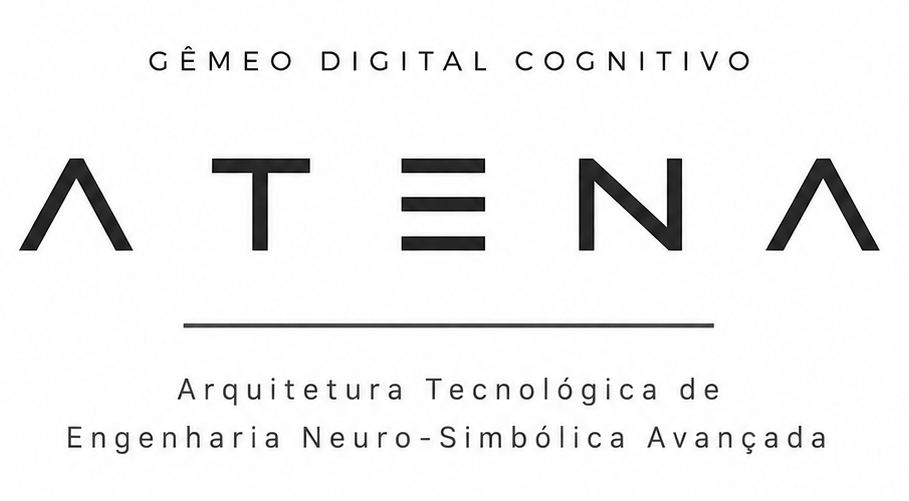

  

<h1 align="center">A.T.E.N.A.</h1>

<i>Gêmeo digital cognitivo para equipamentos industriais</i>

---

## O que é

A ATENA é um aplicativo desktop que dá "voz" a um equipamento industrial: ela lê a
telemetria em tempo real (MQTT ou Modbus TCP), mostra um viewer 3D do equipamento e
conversa com o operador — por texto ou por voz, respondendo ao nome "ATENA" — usando
um modelo de linguagem (Gemini) que entende o contexto do equipamento e pode, com a
confirmação do operador, acionar comandos reais.

Projeto de TCC em Engenharia de Controle e Automação. O equipamento usado como
referência no desenvolvimento é um cilindro pneumático com sensores M12, mas a ideia é
que a mesma aplicação sirva qualquer equipamento com sensores/atuadores MQTT ou Modbus
TCP — basta trocar o projeto configurado.

## Destaques

- **MQTT e Modbus TCP** — fala com o equipamento por qualquer um dos dois
  protocolos, escolhido por projeto, sem precisar de gateway/bridge no meio.
- **Assistente de voz com wake word** — "ATENA" ativa a escuta, resposta com voz neural.
- **Ações reais só com confirmação** — a IA pode propor um comando, mas nada é
  publicado no equipamento sem o operador confirmar explicitamente.
- **Alertas proativos** — a ATENA percebe sozinha quando um sensor sai da faixa
  configurada e avisa, sem precisar ser perguntada.
- **Viewer 3D** do equipamento, com múltiplos objetos e ferramentas de manipulação.
- **Configurável por projeto** — tópicos MQTT, comandos e modelos 3D não são fixos no
  código.

## Sobre este repositório

Este repo existe só para acompanhar o **progresso** do projeto — changelog, decisões
de design e (conforme forem ficando prontas) capturas de tela e vídeos.

O código-fonte é privado (é um projeto pessoal/TCC em desenvolvimento ativo). Se você
tem interesse em ver o código, saber mais ou trocar uma ideia, me chama:

- LinkedIn: [André Cossa](https://linkedin.com/in/andré-cossa-06830b324)
- Email: andre.cossa@outlook.com.br
- Portfólio: [andrecossa-eng.github.io](https://andrecossa-eng.github.io)

## Acompanhe o progresso

Veja o [CHANGELOG.md](CHANGELOG.md) para o histórico de atualizações.
